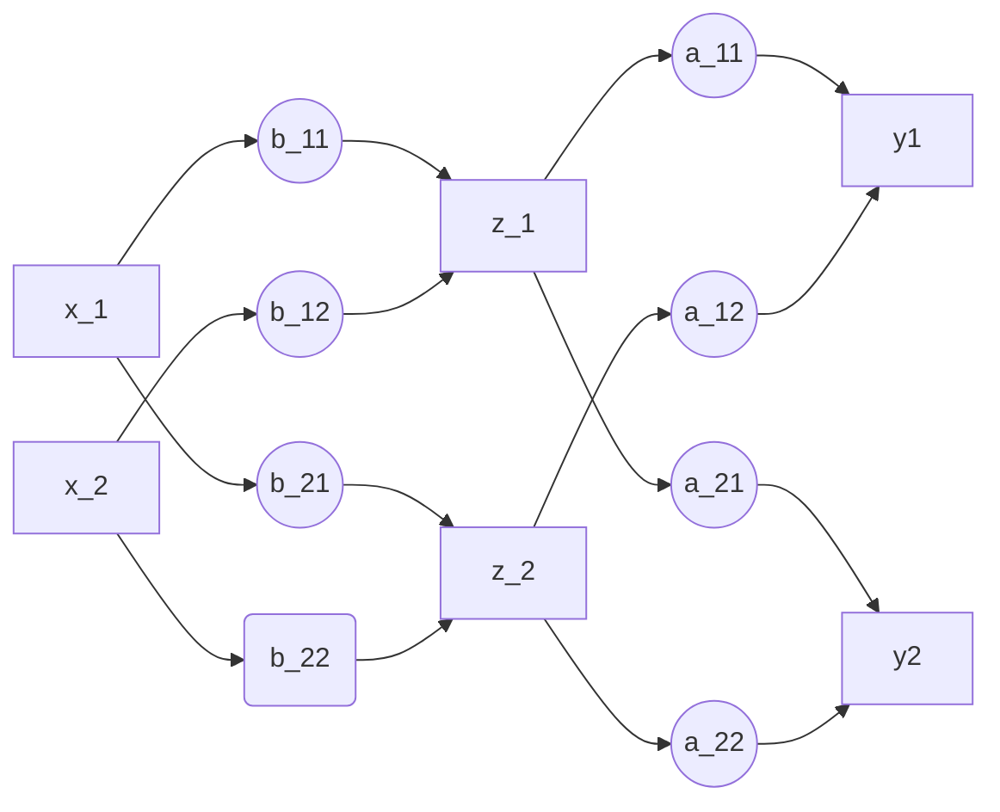

# Linear functions and examples

## Linear equations and functions

- Linear equations can be written as $y=Ax$

$$
y =\left[
\begin{matrix}
y_1\\
y_2\\
\vdots\\
y_m
\end{matrix}
\right]
\space
A = 
\left[
\begin{matrix}
a_{11} & a_{12} & \cdots  a_{1n}\\
a_{21} & a_{22} & \cdots  a_{2n}\\
\vdots & \ddots & \vdots \\
a_{m1} & a_{m2} & \cdots  a_{mn}
\end{matrix}
\right] \space
X = \left[
\begin{matrix}
x_1\\
x_2\\
\vdots\\
x_n
\end{matrix}
\right]
$$

- A function $f: R^n \rightarrow R^m$ is linear if:

$f(ax+by) = af(x) + bf(y), \forall x, y \in R^n, a,b \in R$

- $y = Ax$ is a generic linear function

## interpretations

### Interpretations of $y=Ax$

- y is measurement, x is unknown to be determined (sensor problem, normally over information to solve least-square problem)
- x is input, y is output, A is a system (design problem, solve something like $x = A\overset{.}{x}$, also concerns some least-norm problem)
- A is a map from x to y
- As $y_i = \sum_{j=1}^na_{ij}x_j$, $a_{ij}$ is the gain factor from $y_i$ to $x_j$

### Interpretations of matrix multiplication

- Regarding A as a set of column vectors, y is a mixture of all vectors

$$
A = [\vec{a_1}, \vec{a_2}, \dots, \vec{a_n}], x = [x_1. x_2,\dots, x_n] \\
y = \vec{a_1}x_1 + \vec{a_2}x_2 + \dots + \vec{a_n}x_n
$$

- Regarding A as a set of row vectors, $y_i$ is the inner product of $\vec{a_i}\vec{x}$

$$
A = \left[
\begin{matrix}
\vec{a_1} \\
\vec{a_2} \\
\vdots \\
\vec{a_m} \\
\end{matrix}
\right],
y = \left[
\begin{matrix}
y_1 \\
y_2 \\
\vdots \\
y_m \\
\end{matrix}
\right] = \left[
\begin{matrix}
\vec{a_1}\vec{x} \\
\vec{a_2}\vec{x} \\
\vdots \\
\vec{a_m}\vec{x} \\
\end{matrix}
\right],
$$

 ### Interpretation of inner product

- Entries of matrix multiplications are the inner product of row and col $c_ij=\overset{~}{a_i^T}b_j$
- **Gram Matrix**: it is the defined each entries as the inner product of the respective vector, $G_{ij} = f_i^Tf_j$
- We can use block diagram to explain the matrix multiplications, which is the same as neural network

## Linearization

- Notice that many problems are not linear problem, however, we can do linearization to those problems
- If: $f: R^n \rightarrow R^m$ is **differentiable** at $x_0 \in R^n$, then

$$
x \text{ near } x_0 \Rightarrow  f(x) \text{ very near } f(x_0) + Df(x_0)(x-x_0)
$$

​		where :
$$
Df(x_0)_{ij} = {\partial{f_i} \over \partial{x_j}} \Big|_{x_0}
$$

- When deviations are small, they are (approximately) related by a linear function

